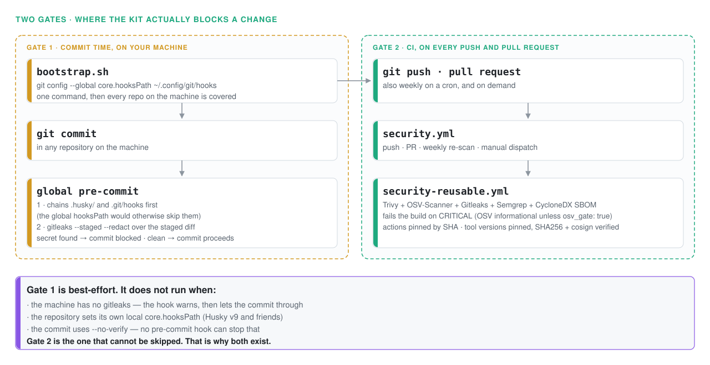
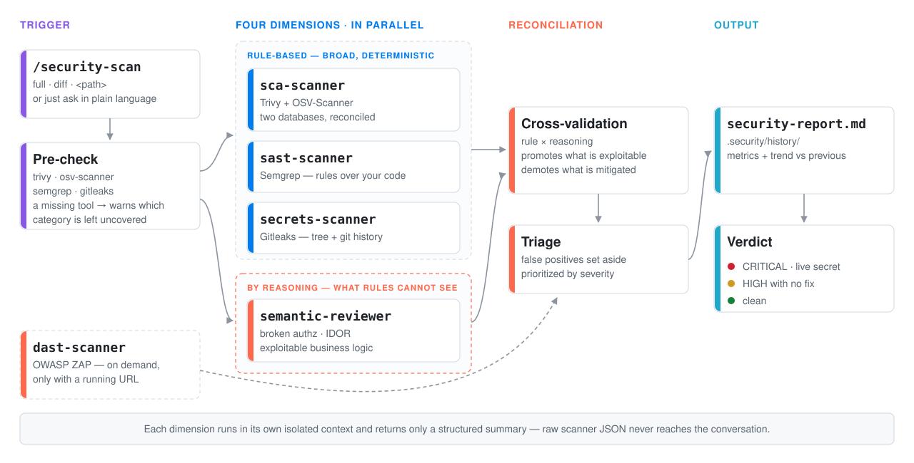

# Security Kit Agent 🛡️ (OSS, anti-Snyk) — Claude + Gemini

**English** · [Português](README.pt-BR.md)

Turns **Claude Code** and the **Gemini CLI** into a Snyk-style security agent using
**open source tools only**, and enforces security across **everything you commit,
build and test** — locally (globally installed) and in **GitHub CI**.

What sets it apart: it combines **two complementary families** of analysis.
**Signature/rule-based** tools (broad, deterministic coverage: CVEs, secrets, IaC,
known insecure patterns) **+** **semantic review by reasoning** (the blind spot of
rules: broken authorization, IDOR, exploitable business logic, dangerous data flow
across files). Rules without reasoning miss logic flaws; reasoning without rules
misses CVEs. This kit runs both and consolidates them into a single report.

| Layer | Snyk equivalent | Tool / method | License |
|---|---|---|---|
| `sca-scanner` | Open Source + Container + IaC + License | **Trivy** + **OSV-Scanner** | Apache-2.0 |
| `sast-scanner` | Snyk Code (rule-based SAST) | **Semgrep CE** | LGPL-2.1 |
| `secrets-scanner` | Secret detection | **Gitleaks** | MIT |
| `semantic-reviewer` | (beyond Snyk: authz/IDOR/logic) | **LLM reasoning** | — |
| `dast-scanner` | (not covered by stock Snyk) | **OWASP ZAP** | Apache-2.0 |
| Global git hook | Prevention at commit time | Gitleaks | — |
| Reusable CI | PR gate | Trivy+OSV+Semgrep+Gitleaks | — |

> This repo consolidates the former `claude-security-kit` (kit + CI) with the
> portable `security_skills` setup (personal skills + Claude/Gemini bootstrap).
> It is the single tooling repo — it installs into `~/.claude` **and** `~/.gemini`.

## Where it blocks

<picture>
  <source media="(prefers-color-scheme: dark)" srcset="docs/img/gates-dark.svg">
  
</picture>

The commit-time hook is the fast feedback loop, not the guarantee. It is skipped
when `gitleaks` isn't installed, when a repository sets its own local
`core.hooksPath` (Husky v9 and friends), and by `git commit --no-verify` — no
pre-commit hook can stop that last one. **CI is the gate that holds**, which is
why the kit ships both.

## Installation (Claude + Gemini, one command)

```bash
git clone git@github.com:geraldoschuetze/security-kit-agent.git
cd security-kit-agent
bash bootstrap.sh                # Claude + Gemini + global git hook + tools
```
Flags: `--no-gemini` (Claude only) · `--no-tools` (skips trivy/osv-scanner/semgrep/gitleaks).

`bootstrap.sh` is idempotent and:
1. Copies the security skills, `agents` and `scripts` into `~/.claude/`.
2. Copies the skills into `~/.gemini/skills` (they serve both).
3. Installs the `settings.json` files from **sanitized templates** (only if they
   don't already exist — it never overwrites yours). You fill in the
   `__SET_...__` placeholders.
4. Enables the **GLOBAL commit-time git hook** (`core.hooksPath`) that blocks any
   commit containing a secret in **any** repository on the machine.
5. Installs **trivy / osv-scanner / semgrep / gitleaks** (pinned versions +
   verified checksums).

## How to trigger it (step by step)

Skills and agents are **global** — they work in any project, with nothing to
install per repository.

```bash
cd ~/path/to/project
claude        # or: gemini
```
In a new conversation, kick off the full audit:
```
/security-scan
```
Or in plain language: *"run a security audit"*, *"check for vulnerabilities
before the deploy"*.

**Modes and targeting:**
| Goal | What to type |
|---|---|
| Full audit (whole repo) | `/security-scan` |
| PR mode (diff vs `main` only) | `/security-scan diff` |
| A single subdirectory | `/security-scan <path>` |
| Dependencies/CVEs only | *"run the `sca-scanner` on this project"* |
| Secrets only (tree + history) | *"run the `secrets-scanner`"* |
| Logic/authz only (reasoning) | *"run the `semantic-reviewer`"* |
| Include DAST (app running) | *"/security-scan including DAST at http://localhost:3000"* |
| Legacy codebase (only what's new) | *"scan with baseline at commit `<sha>`"* |

**Output:** `security-report.md` at the root + versioned history under
`.security/history/` (timestamped report + `security-metrics-*.json`), with a
**verdict** 🔴/🟡/🟢 and the **trend** against the previous scan.

> **Gemini CLI** has no subagents: the `/security-scan` skill detects this and
> runs each dimension **inline**, following the same methodology as the agents.
> In Claude Code it delegates to each subagent in an isolated context.

> If Claude Code / Gemini was already open when you installed, **restart the
> session** — skills and agents load at session start.

## The agents in detail

Each dimension is delegated to a specialized subagent that runs in an **isolated
context** (scan noise doesn't pollute the conversation), is **read-only + Bash**
(never edits files) and returns **only a structured summary** (never raw JSON).

### 🧩 `sca-scanner` — dependencies, IaC, container, licenses (Trivy + OSV-Scanner)
CVEs in dependencies (with the fixing version), IaC misconfigurations (Dockerfile,
Terraform, Kubernetes, CloudFormation, Helm), container image vulnerabilities and
problematic licenses. Equivalent to Snyk Open Source + Container + IaC + License.

It runs **two complementary vulnerability databases** and reconciles the results
into a single list:

| | Trivy | OSV-Scanner |
|---|---|---|
| Source | NVD + GHSA + distro advisories | OSV.dev (GHSA, PySec, RustSec, Go…) |
| Indexed by | **CVE** | **advisory ID** |
| Blind spot | advisories **with no CVE assigned** | app dependencies only (no IaC/image/license) |
| Lockfiles | broad, **no `bun.lock`** | broad, **including `bun.lock`** |

The report tags every finding as `both` · `OSV only` · `Trivy only`. The
`OSV only` bucket is what justifies the second database: it is the same class of
finding that commercial tools report under a proprietary ID and that Trivy alone
would never surface.

> ⚠️ **True for both:** they read the **lockfile**, not the installed tree. A stale
> copy left behind in `node_modules/<pkg>/node_modules/` by an older install goes
> unnoticed. When your results disagree with a commercial scanner, check what is
> actually installed — the skill has a playbook for this (*"When the user brings a
> finding from a commercial scanner"*).

### 🔎 `sast-scanner` — your own code, by rule (Semgrep)
SQL injection (including Prisma `$queryRawUnsafe`), XSS, command injection, path
traversal, SSRF, insecure deserialization, weak crypto and leaks via
`NEXT_PUBLIC_*`. **Pinned** rulesets + `--metrics=off`. Maps CWE/OWASP and triages
by reading the surrounding code. Equivalent to Snyk Code.

### 🧠 `semantic-reviewer` — logic & authorization by reasoning *(what rules can't catch)*
Broken authorization / **IDOR**, exploitable business logic (negative prices,
replay, TOCTOU, state-machine bypass), dangerous data flow **across files** (which
Semgrep CE does not track), missing validation/authz, PII exposure. It runs no
tool — it **reasons about the code**, tracing source→sink and requiring a concrete
exploitation scenario before classifying something as a real finding. This is the
piece that signature-based tools structurally do not cover.

### 🔑 `secrets-scanner` — secrets and credentials (Gitleaks)
API keys, tokens, passwords and private keys in the **working tree** and across
**the entire git history**. **Never transcribes the value** — only type, file:line
and commit. A real secret = **CRITICAL** + **rotate the credential at the
provider** (rewriting history does not undo clones/forks).

### 🌐 `dast-scanner` — running application (OWASP ZAP) — *on-demand*
Missing headers (CSP, HSTS), cookies without `Secure`/`HttpOnly`/`SameSite`,
reflected XSS, exposed stack traces, permissive CORS. ZAP baseline via Docker
against a URL **you** provide. **Never runs automatically** (it generates real
traffic).

## Execution order

<picture>
  <source media="(prefers-color-scheme: dark)" srcset="docs/img/scan-dark.svg">
  
</picture>

**Cross-validation** is the payoff of combining both families: a SAST finding that
the semantic review confirms exploitable is **promoted** in severity; a finding it
shows to be mitigated is **demoted** to the false-positive appendix, with the
rationale.

## GitHub — reusable CI

- `.github/workflows/security-reusable.yml` (`workflow_call`) — Trivy +
  **OSV-Scanner** + Gitleaks + Semgrep + **CycloneDX SBOM**, **fails on CRITICAL**.
  Official Docker images pinned by version and first-party actions **pinned by
  SHA** (`trivy-action` suffered a supply-chain attack in Mar/2026 — which is why
  we don't use it). OSV is **informational by default**; pass `osv_gate: true` to
  make it block the build too.
- `.github/workflows/security.yml` — auto-scan on push/PR + **weekly re-scan**
  (cron) + `workflow_dispatch`.

In another repo, reference it in ~10 lines:
```yaml
jobs:
  security:
    uses: geraldoschuetze/security-kit-agent/.github/workflows/security-reusable.yml@v1
    with: { fail_on_severity: CRITICAL, osv_gate: false }
```
> **Private repo**: under Settings → Actions → *Access*, allow use by repositories
> in the account. To push workflows via the API: a `gh` token with the `workflow`
> scope (`gh auth refresh -s workflow`).

## Repo structure

```
security-kit-agent/
├── bootstrap.sh                     # multi-machine installer (Claude + Gemini)
├── claude/
│   ├── agents/                      # sca · sast · secrets · dast · semantic-reviewer
│   ├── skills/                      # security-scan · security-audit · api-/web-security-testing
│   ├── scripts/                     # install-tools.sh · gitleaks-gate.sh
│   └── settings.template.json       # minimal template: only the PreToolUse hook (gitleaks)
├── gemini/
│   └── settings.template.json       # sanitized template (Gemini CLI)
├── git-hooks/
│   └── pre-commit                   # global commit-time git hook (Gitleaks)
└── .github/workflows/               # security.yml + security-reusable.yml
```

## Scope and rules
- **Security only**: no style/refactoring/performance.
- **Secrets**: report type/file/line/commit — **never the value** (redacted).
- Subagents run isolated and return summaries only (not raw JSON).
- A secret in history = **rotate the credential** (rewriting history does not undo clones).
- `settings.json` templates are **sanitized** (`__SET_...__` placeholders) — no secrets in the repo.

## Caveats
- The first scan downloads databases (Trivy) and rulesets (Semgrep) — it needs internet access.
- **A stale Trivy DB means recent CVEs go unreported.** The `sca-scanner` checks
  `UpdatedAt` in `~/.cache/trivy/db/metadata.json` and records the date in the report.
- No lockfile scanner sees a stale copy left in `node_modules` by an older install.
  Disagreeing with a commercial scanner? Check the installed tree.
- Semgrep CE analyzes file by file (no cross-file taint) — the `sast-scanner` reads
  the surrounding code and the `semantic-reviewer` covers cross-file flow.
- **TruffleHog** (verifying whether a secret is live) is AGPL: use it only via
  container in CI.
