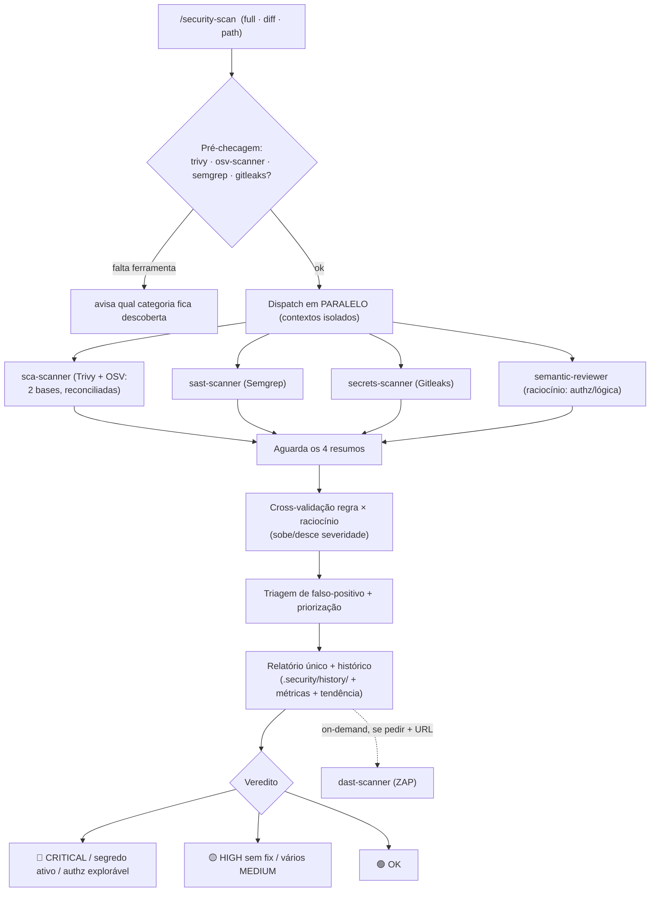

# Security Kit Agent 🛡️ (OSS, anti-Snyk) — Claude + Gemini

[English](README.md) · **Português**

Transforma o **Claude Code** e o **Gemini CLI** num agente de segurança estilo
Snyk usando **só ferramentas open source**, e garante segurança em **tudo que é
commitado, criado e testado** — localmente (global) e no **GitHub CI**.

O diferencial: junta **duas famílias complementares** de análise. Ferramentas de
**assinatura/regra** (cobertura ampla e determinística: CVEs, secrets, IaC,
padrões inseguros) **+** **revisão semântica por raciocínio** (o ponto cego das
regras: autorização quebrada, IDOR, lógica de negócio explorável, fluxo de dados
entre arquivos). Regra sem raciocínio perde falha de lógica; raciocínio sem regra
perde CVE. Este kit roda as duas e consolida num relatório único.

| Camada | Equivalente Snyk | Ferramenta / método | Licença |
|---|---|---|---|
| `sca-scanner` | Open Source + Container + IaC + Licenças | **Trivy** + **OSV-Scanner** | Apache-2.0 |
| `sast-scanner` | Snyk Code (SAST por regra) | **Semgrep CE** | LGPL-2.1 |
| `secrets-scanner` | Detecção de segredos | **Gitleaks** | MIT |
| `semantic-reviewer` | (além do Snyk: authz/IDOR/lógica) | **Raciocínio LLM** | — |
| `dast-scanner` | (não coberto pelo Snyk padrão) | **OWASP ZAP** | Apache-2.0 |
| Hook git global | Prevenção sem-bypass | Gitleaks | — |
| CI reutilizável | Gate de PR | Trivy+OSV+Semgrep+Gitleaks | — |

> Este repo consolida o antigo `claude-security-kit` (kit + CI) com o setup
> portátil `security_skills` (skills pessoais + bootstrap Claude/Gemini). É o
> único repo de tooling — instala em `~/.claude` **e** `~/.gemini`.

## Instalação (Claude + Gemini, um comando)

```bash
git clone git@github.com:geraldoschuetze/security-kit-agent.git
cd security-kit-agent
bash bootstrap.sh                # Claude + Gemini + hook git global + ferramentas
```
Flags: `--no-gemini` (só Claude) · `--no-tools` (pula trivy/osv-scanner/semgrep/gitleaks).

O `bootstrap.sh` é idempotente e:
1. Copia as skills, `agents` e `scripts` de segurança para `~/.claude/`.
2. Copia as skills para `~/.gemini/skills` (servem para os dois).
3. Instala os `settings.json` a partir de **templates sanitizados** (só se não
   existirem — nunca sobrescreve os seus). Você preenche os placeholders `__SET_...__`.
4. Ativa o **hook git GLOBAL sem-bypass** (`core.hooksPath`) que bloqueia commit
   com segredo em **qualquer** repositório da máquina.
5. Instala **trivy / osv-scanner / semgrep / gitleaks** (versões fixas + checksum
   verificado).

## Como acionar (passo a passo)

Skills e agentes são **globais** — valem em qualquer projeto, sem instalar nada
por repositório.

```bash
cd ~/caminho/do/projeto
claude        # ou: gemini
```
Numa conversa nova, dispare a auditoria completa:
```
/security-scan
```
Ou em linguagem natural: *"faça uma auditoria de segurança"*, *"verifique
vulnerabilidades antes do deploy"*.

**Modos e mira:**
| Objetivo | O que digitar |
|---|---|
| Auditoria completa (repo inteiro) | `/security-scan` |
| Modo PR (só o diff vs `main`) | `/security-scan diff` |
| Só um subdiretório | `/security-scan <path>` |
| Só dependências/CVEs | *"rode o `sca-scanner` neste projeto"* |
| Só segredos (tree+histórico) | *"rode o `secrets-scanner`"* |
| Só lógica/authz (raciocínio) | *"rode o `semantic-reviewer`"* |
| Incluir DAST (app no ar) | *"/security-scan incluindo DAST em http://localhost:3000"* |
| Base legada (só o que é novo) | *"scan com baseline no commit `<sha>`"* |

**Saída:** `security-report.md` na raiz + histórico versionado em
`.security/history/` (relatório timestampado + `security-metrics-*.json`), com
**veredito** 🔴/🟡/🟢 e **tendência** vs. o scan anterior.

> **Gemini CLI** não tem subagentes: a skill `/security-scan` detecta isso e roda
> cada dimensão **inline**, seguindo a mesma metodologia dos agentes. No Claude
> Code, delega a cada subagente em contexto isolado.

> Se o Claude Code / Gemini já estava aberto quando você instalou, **reinicie a
> sessão** — skills e agentes carregam no início da sessão.

## Os agentes em detalhe

Cada dimensão é delegada a um subagente especializado, que roda em **contexto
isolado** (o "lixo" dos scans não polui a conversa), é **read-only + Bash** (não
edita arquivos) e retorna **apenas um resumo estruturado** (nunca JSON bruto).

### 🧩 `sca-scanner` — dependências, IaC, container, licenças (Trivy + OSV-Scanner)
CVEs em dependências (com a versão que corrige), misconfigurações de IaC
(Dockerfile, Terraform, Kubernetes, CloudFormation, Helm), vulnerabilidades em
imagens de container e licenças problemáticas. Equivale a Snyk Open Source +
Container + IaC + License.

Roda **duas bases de vulnerabilidade que se complementam** e reconcilia os
resultados numa lista só:

| | Trivy | OSV-Scanner |
|---|---|---|
| Fonte | NVD + GHSA + avisos de distro | OSV.dev (GHSA, PySec, RustSec, Go…) |
| Indexa por | **CVE** | **ID de advisory** |
| Ponto cego | advisory **sem CVE atribuído** | só dependência de app (não faz IaC/imagem/licença) |
| Lockfiles | amplo, **sem `bun.lock`** | amplo, **com `bun.lock`** |

O relatório marca cada achado como `ambos` · `só OSV` · `só Trivy`. O `só OSV` é o
que justifica a segunda base: é a mesma classe de achado que ferramentas
comerciais reportam com ID proprietário e que o Trivy sozinho nunca veria.

> ⚠️ **Vale para os dois:** ambos leem o **lockfile**, não a árvore instalada. Cópia
> obsoleta sobrando em `node_modules/<pkg>/node_modules/` de uma instalação antiga
> passa despercebida. Ao divergir de um scanner comercial, confira o que está
> instalado de fato — a skill tem um roteiro para isso (*"Quando o usuário traz um
> achado de scanner comercial"*).

### 🔎 `sast-scanner` — código próprio por regra (Semgrep)
SQL injection (inclusive Prisma `$queryRawUnsafe`), XSS, command injection, path
traversal, SSRF, deserialização insegura, crypto fraca e vazamento via
`NEXT_PUBLIC_*`. Rulesets **fixos** + `--metrics=off`. Mapeia CWE/OWASP e faz
triagem lendo o código ao redor. Equivale a Snyk Code.

### 🧠 `semantic-reviewer` — lógica & autorização por raciocínio *(o que a regra não pega)*
Autorização quebrada / **IDOR**, lógica de negócio explorável (preço negativo,
replay, TOCTOU, bypass de máquina-de-estados), fluxo de dado perigoso **entre
arquivos** (que o Semgrep CE não rastreia), validação/authz ausente, exposição de
PII. Não roda ferramenta — **raciocina sobre o código**, rastreando origem→sink e
exigindo um cenário de exploração concreto para classificar como achado real.
É a peça que ferramentas de assinatura estruturalmente não cobrem.

### 🔑 `secrets-scanner` — segredos e credenciais (Gitleaks)
API keys, tokens, senhas e chaves privadas no **working tree** e em **todo o
histórico git**. **Nunca transcreve o valor** — só tipo, arquivo:linha e commit.
Segredo real = **CRITICAL** + **rotacionar a credencial no provedor** (reescrever
histórico não desfaz clones/forks).

### 🌐 `dast-scanner` — aplicação rodando (OWASP ZAP) — *on-demand*
Headers ausentes (CSP, HSTS), cookies sem `Secure`/`HttpOnly`/`SameSite`, XSS
refletido, stack traces expostos, CORS permissivo. ZAP baseline via Docker contra
uma URL que **você** fornece. **Não roda automaticamente** (gera tráfego real).

## Ordem de execução



A **cross-validação** é o ganho da junção: achado do SAST que a revisão semântica
confirma explorável **sobe** de severidade; achado que ela mostra mitigado
**desce** para o apêndice de falsos positivos, com justificativa.

## GitHub — CI reutilizável

- `.github/workflows/security-reusable.yml` (`workflow_call`) — Trivy +
  **OSV-Scanner** + Gitleaks + Semgrep + **SBOM CycloneDX**, **falha em CRITICAL**.
  Imagens Docker oficiais fixadas por versão e actions first-party **fixadas por
  SHA** (a `trivy-action` sofreu supply-chain attack em mar/2026 — por isso não a
  usamos). O OSV é **informativo por padrão**; passe `osv_gate: true` para que ele
  também bloqueie o build.
- `.github/workflows/security.yml` — auto-scan em push/PR + **re-scan semanal**
  (cron) + `workflow_dispatch`.

Em outro repo, referencie em ~10 linhas:
```yaml
jobs:
  security:
    uses: geraldoschuetze/security-kit-agent/.github/workflows/security-reusable.yml@v1
    with: { fail_on_severity: CRITICAL, osv_gate: false }
```
> Repo **privado**: em Settings → Actions → *Access*, permita o uso por
> repositórios da conta. Para subir workflows via API: token `gh` com escopo
> `workflow` (`gh auth refresh -s workflow`).

## Estrutura do repo

```
security-kit-agent/
├── bootstrap.sh                     # instalador multi-máquina (Claude + Gemini)
├── claude/
│   ├── agents/                      # sca · sast · secrets · dast · semantic-reviewer
│   ├── skills/                      # security-scan · security-audit · api-/web-security-testing
│   ├── scripts/                     # install-tools.sh · gitleaks-gate.sh
│   └── settings.template.json       # template mínimo: só o hook PreToolUse (gitleaks)
├── gemini/
│   └── settings.template.json       # template sanitizado (Gemini CLI)
├── git-hooks/
│   └── pre-commit                   # hook git global sem-bypass (Gitleaks)
└── .github/workflows/               # security.yml + security-reusable.yml
```

## Escopo e regras
- **Só segurança**: nada de estilo/refatoração/performance.
- **Segredos**: reportar tipo/arquivo/linha/commit — **jamais o valor** (redigido).
- Subagentes rodam isolados e retornam só resumos (não JSON bruto).
- Segredo no histórico = **rotacione a credencial** (reescrever histórico não desfaz clones).
- Templates de `settings.json` são **sanitizados** (placeholders `__SET_...__`) — nenhum segredo no repo.

## Avisos
- 1º scan baixa DBs (Trivy) e rulesets (Semgrep) — precisa de internet.
- **DB do Trivy velho = CVE recente não reportado.** O `sca-scanner` confere o
  `UpdatedAt` em `~/.cache/trivy/db/metadata.json` e registra a data no relatório.
- Nenhum scanner de lockfile enxerga cópia obsoleta deixada em `node_modules` por
  instalação antiga. Divergiu de um scanner comercial? Confira a árvore instalada.
- Semgrep CE analisa arquivo a arquivo (sem taint entre arquivos) — o
  `sast-scanner` lê o código ao redor e o `semantic-reviewer` cobre o fluxo entre arquivos.
- **TruffleHog** (verificar se segredo está ativo) é AGPL: use só via container no CI.
